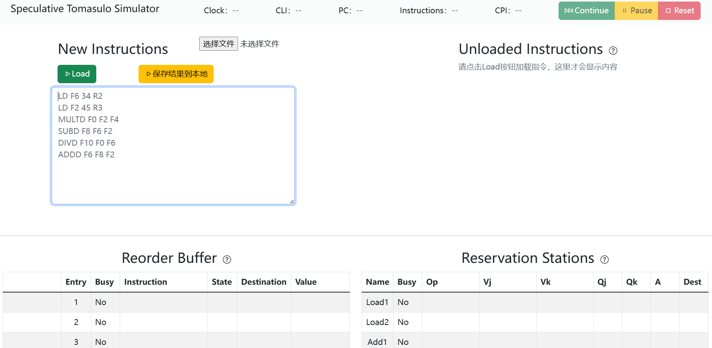
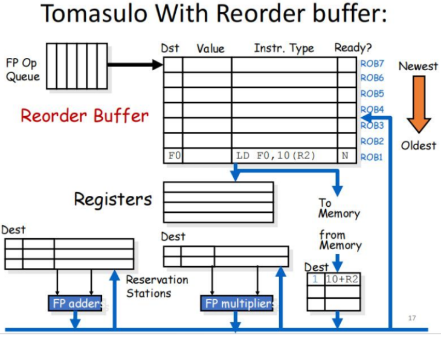

# Speculative Tomasulo 算法可视化演示
SYSU Computer Architecture Final Project: A speculative tomasulo simulator with ROB(Reorder Buffer)



使用 `html + js + css` 前端语言，实现了一个交互网页前端，实现了对带有 `Reorder Buffer` 的 `Speculative Tomasulo` 算法进行模拟，结果的输出直观且美观，可以自己输入指令或者导入文本文件，前端还有其他丰富的交互选项，有助于初学者更好地掌握算法


## 技术栈
* 主要算法结构——JavaScript
* 可视化——Bootstrap 5+HTML+CSS
* 在原先HTML界面的基础上，运用Bootstrap组件增强可视化体验

## 项目结构
* 网页主文件 `index.html`
* 驱动程序 `app.js`
* 基础类实现 `simulate.js`
  * `Instruction` 指令类表示
    ```js
    function Instruction(Op, dest, source_1, source_2) {
      this.Op = Op;  // 操作码
      this.dest = dest;  // 目标寄存器
      this.source_1 = source_1;  // 源寄存器1
      this.source_2 = source_2;  // 源寄存器2
      this.state = 0; // 指令运行状态，0: not run, 1: running, 2: finished
      this.stage = ["", "", "", ""];  // 阶段
      // stage[0]=Issue, stage[1]=Operand, stage[2]=Execute, stage[3]=Write result
    }
    ```
  * `Controller` 控制器类表示
    ```js
    function Controller(instructions) {
      this.clock = 0;     // 系统时钟
      this.maxFetchSize = 10;     // 模拟器一次最多执行指令的数量
      this.instructions = instructions;   // 需要执行的指令
      this.fetched = [];  // 已经准备好且可以运行的指令列表
      // 实例化保留站, 本模拟器中的可用的功能组件
      this.ReservationStationsSet = {
          "Load1": new ReservationStations("Load1", 1),
          "Load2": new ReservationStations("Load2", 1),
          "Add1": new ReservationStations("Add1", 2),
          "Add2": new ReservationStations("Add2", 2),
          "Add3": new ReservationStations("Add3", 2),
          "Mult1": new ReservationStations("Mult1", 10),
          "Mult2": new ReservationStations("Mult2", 10)
      };
      // 指令对应的功能组件
      this.opToReservationStations = {
          "LD": ["Load1", "Load2"],
          "SD": ["Load1", "Load2"],
          "ADDD": ["Add1","Add2","Add3"],
          "SUBD": ["Add1", "Add2", "Add3"],
          "MULTD": ["Mult1", "Mult2"],
          "DIVD": ["Mult1", "Mult2"]
      }
      // 实例化ROB
      this.ReorderBufferSet = {
          "E1": new ReorderBuffer("E1", 1),
          "E2": new ReorderBuffer("E2", 1),
          "E3": new ReorderBuffer("E3", 1),
          "E4": new ReorderBuffer("E4", 1),
          "E5": new ReorderBuffer("E5", 1),
          "E6": new ReorderBuffer("E6", 1)
      };
      // 本模拟器中可用的寄存器
      this.registers = {
          // F0~F31, R0~R31
          // 每个使用 new Register() 初始化
      }
    }
    ```
  * `Register` 寄存器类表示
    ```js
    function Register(name) {
      this.name = name;
      this.Busy = "No"; // false: not busy, true: busy
      this.Reorder = "";
      this.read = 0;
      this.Value = "";
      this.history = "";
    }
    ```

## 什么是 Tomasulo 算法

Tomasulo 算法是一种用于指令动态调度的计算机架构硬件算法，能够有效地利用多个执行单元乱序执行指令。Tomasulo 算法因为控制指令、程序异常和外部中断会截断指令流而无法顺序提交指令，而乱序提交无法满足处理器按照程序顺序来执行指令的需求。

Speculative Tomasulo 算法是带有重新排序缓存的 Tomasulo。重排序缓存可以让乱序执行的指令被顺序地提交，其核心思想是记录下指令在程序中的顺序，一条指令在执行完毕之后不会立马提交，而是先在 Buffer 中等待，等到前面的所有指令都提交完毕，才可以提交结果到逻辑寄存器堆。



## 欢迎PR

由于本人做大作业的时候比较匆忙，网页有些功能没实现好，会有些bug，欢迎感兴趣的小伙伴提交 PR 呀！

最后，如果本项目对您有帮助，还请给作者一个小小的 Star 吧~